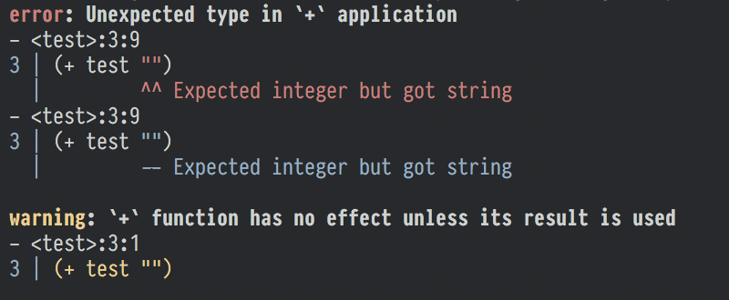

# codespan-reporting

[![Build Status][travis-badge]][travis-url]
[![Crates.io][crate-badge]][crate-url]
[![Docs.rs][docs-badge]][docs-url]
[![Gitter][gitter-badge]][gitter-lobby]

[travis-badge]: https://travis-ci.org/brendanzab/codespan.svg?branch=master
[travis-url]: https://travis-ci.org/brendanzab/codespan
[crate-url]: https://crates.io/crates/codespan-reporting
[crate-badge]: https://img.shields.io/crates/v/codespan-reporting.svg
[docs-url]: https://docs.rs/codespan-reporting
[docs-badge]: https://docs.rs/codespan-reporting/badge.svg
[gitter-badge]: https://badges.gitter.im/codespan-rs/codespan.svg
[gitter-lobby]: https://gitter.im/codespan-rs/Lobby

Diagnostic reporting support for the codespan crate.

## Running the CLI example

To get an idea of what the colored CLI output looks like with
`codespan-reporting`, clone the repository and run the following:

```sh
cargo run -p codespan-reporting --example=term
cargo run -p codespan-reporting --example=term -- --color never
```

You should see something like the following in your terminal:



We're still working on the output - stay tuned for updates!
